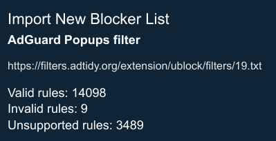

### v1.0 (02-25-2024)

* Initial release

### v1.1 (03-19-2024)

* I've swapped out the custom ad blocking source [OISD](https://big.oisd.nl/) for [Hagezi's Pro DNS Blocklist](https://raw.githubusercontent.com/hagezi/dns-blocklists/main/adblock/pro.txt). It's another big list. Opinions suggest that it is more reliable, effective, and curated more discerningly.

* More information about the Hagezi lists can be found at [Hagezi's GitHub](https://github.com/hagezi/dns-blocklists/blob/main/README.md)

* So far, I've found the Multi PRO version to be the most effective. There is a Pro++ and an Ultimate version, but I've found that even just going up to the Pro++ version causes major response issues. There were other random sites with an extreme slowdown, but Google Apps sites such as Drive and Docs are an example. It could be a combination of lists or other factors, but the Pro version is what's recommended.

### v1.2 (03-22-2024)

* I've added the custom ad blocking source [AdGuard Popups filter](https://filters.adtidy.org/extension/ublock/filters/19.txt)
* It has been great at removing those impenetrable 'Disable your ad blocker' type of overlays that won't allow you to continue.  It's worked on the few that I've encountered on the desktop and has been amazing on the mobile version, where those anti-adblock pop-ups seem much more prevalent.
* It is an AdGuard filter, which is not always completely compatible with Vivaldi.  But I feel that the results outweigh the number of unsupported rules.

    

### v1.3 (04-01-2024)

* Added [Anti-Facebook List](https://secure.fanboy.co.nz/fanboy-antifacebook.txt) to the *Custom Tracker Blocking Sources* section.
* This filter aims to block embedded Facebook trackers and elements embedded on non-Facebook websites.
* The filter's [maintainer recommends](https://fanboy.co.nz) using it with Vivaldi's built-in ad blocking source *Remove annoyances, can break sites (Fanboy's Annoyance List)*
