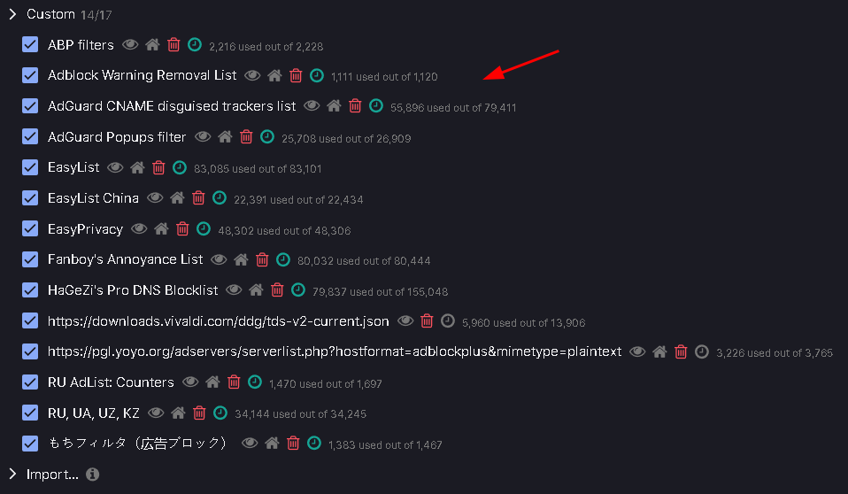

# Vivaldi: Tracker / Ad Blocking Lists (Customized)
This is the current collection of Tracker and Ad Blocking sources that I am using with Vivaldi's native ad blocker, to enhance its effectiveness. I’ve tried to minimize sources with overlapping rules [See below](#evaluating-sources). Enable any additional Regions / Language sources that are relevant to your needs. 

Vivaldi’s [Block Trackers and Ads](https://help.vivaldi.com/desktop/privacy/tracking-and-ad-blocking/) guide can help you get started (There are mobile guides as well). Once you get to that point, below are my sources of choice.

- Disable all the **Built-In** rules except those listed below. You will then have to enable the sources that aren’t on by default.
- Manually add the **Custom** sources in their appropriate sections - Tracker Blocking or Ad Blocking
- You can view updates and explanations in the [Changelog](https://github.com/dayvid3/Vivaldi-Tracker_Ad_Blocking_Lists-Customized/blob/main/CHANGELOG.md)

## Tracker Blocking Sources

- **(Enable)** Built-In Tracker Blocking Sources:
  - [DuckDuckGo Tracker Radar](https://downloads.vivaldi.com/ddg/tds-v2-current.json)
  - [EasyPrivacy](https://downloads.vivaldi.com/easylist/easyprivacy-current.txt)

- **(Add)** Custom Tracker Blocking Sources:
  - AdGuard CNAME disguised trackers list
    - https://raw.githubusercontent.com/AdguardTeam/cname-trackers/master/data/combined_disguised_trackers.txt
## Ad Blocking Sources

- **(Enable)** Built-In Ad Blocking Sources:
  - [ABP anti-circumvention list](https://downloads.vivaldi.com/lists/abp/abp-filters-anti-cv-current.txt)
  - [Adblock Warning Removal List](https://downloads.vivaldi.com/lists/abp/antiadblockfilters-current.txt)
  - [EasyList](https://downloads.vivaldi.com/easylist/easylist-current.txt)
  - [English (Peter Lowe’s List)](https://pgl.yoyo.org/adservers/serverlist.php?hostformat=adblockplus&mimetype=plaintext)
  - [Remove annoyances, can break sites (Fanboy's Annoyance List)](https://secure.fanboy.co.nz/fanboy-annoyance.txt)
- **(Enable)** Built-In Regions / Languages (Some countries with lots of bad actors, and Japanese for possible Mange / Anime sites):
  - [Chinese (EasyList China)](https://easylist-downloads.adblockplus.org/easylistchina.txt)
  - [Japanese (もちフィルタ（広告ブロック）)](https://raw.githubusercontent.com/eEIi0A5L/adblock_filter/master/mochi_filter.txt)
  - [Russian (RU AdList)](https://easylist-downloads.adblockplus.org/advblock.txt)

- **(Add)** Custom Ad Blocking Sources:
  - AdGuard Popups filter
    - https://filters.adtidy.org/extension/ublock/filters/19.txt
  - Hagezi's Pro DNS Blocklist *(Replaces OISD)*
    - https://raw.githubusercontent.com/hagezi/dns-blocklists/main/adblock/pro.txt
  - RU AdList: Counters *(Compliments RU AdList on sites like Yandex Search)*
    - https://easylist-downloads.adblockplus.org/cntblock.txt

## Evaluating Sources
Ironically, I'm using a uBlock Origin feature to check if different filter lists are being utilized enough to justify adding each list, or if some lists have so much overlap, that they are redundant.  I disable all the existing uBO filters and import the native Vivaldi sources and custom filters.  As shown below, you can see how many rules from each list are being utilized.

*Note: If lists have overlapping rules, the first list enabled will use those rules, and the next list will not show those rules as used.  If the first list is disabled, the second list will change and show those rules now being used.  If the first list is re-enabled, it will be the one that shows the overlapping rules as not used.

